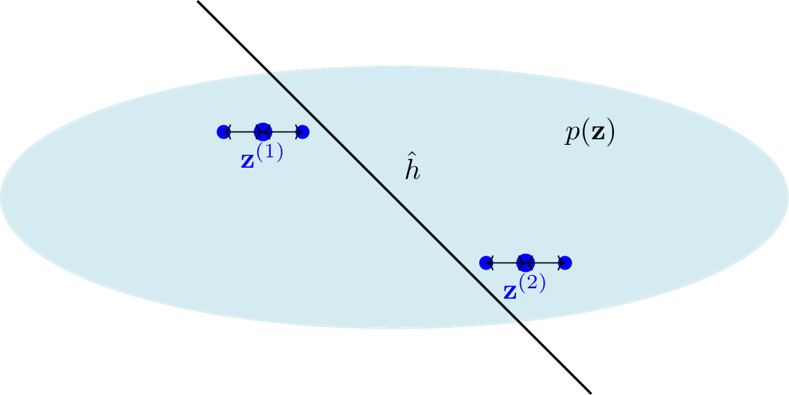

# Generalization in Machine Learning: Why Models Fail on Unseen Data

> **TL;DR**: Generalization is a model’s ability to make accurate predictions on new, unseen data 
after training. This post explains probabilistic and robustness-based views of generalization, including 
empirical risk minimization (ERM) and perturbation tests.

---

Generalization refers to the ability of a [machine learning (ML)](https://en.wikipedia.org/wiki/Machine_learning)
method trained on a training set to make accurate predictions on **new, unseen data**. 
This is a central goal of ML and AI: to learn patterns that extend beyond the data 
available during training.

Most ML systems use [empirical risk minimization (ERM)](https://youtu.be/8fsJCyBOizQ?si=Sd8TMFEKVm7xxmN2) to 
learn a [hypothesis](https://youtu.be/ATi5IVWjsHw?si=dM_Wtdl7M_3EtWMw) $\hat{h} \in \mathcal{H}$ by minimizing 
the average [loss](https://youtu.be/BWI9jiJHzDU?si=X0wizHBCSGVISq3e) over a training set of [data points](https://youtu.be/onhGcR3ds5c?si=SXvjdFCY5Z4N08gF) 
${\bf z}^{(1)}, \ldots, {\bf z}^{(m)}$, denoted as $\mathcal{D}^{(\rm train)}$. However, success on the 
training set does not guarantee success on unseen data—this discrepancy is the **challenge of generalization**.

To study generalization mathematically, we often assume a **probabilistic model** for data generation, such as the 
[i.i.d. assumption](https://youtu.be/8fsJCyBOizQ?si=ti58BTGupeIan9xC&t=438). That is, we interpret data points 
as independent random variables (RVs) with an identical probability distribution $p({\bf z})$. This distribution, 
while unknown, allows us to define the **risk** of a trained model $\hat{h}$ as the expected loss:


$$
\bar{L} \big( \hat{h} \big) = \mathbb{E}_{{\bf z} \sim p({\bf z})} \left\{ L(\hat{h}, {\bf z}) \right\}.
$$


The difference between risk $\bar{L}(\hat{h})$ and empirical risk $\widehat{L}(\hat{h}|\mathcal{D}^{(\rm train)})$ is 
called the **generalization gap**. Tools from probability theory—such as concentration inequalities and uniform 
convergence—can be used to bound this gap under specific conditions (Shalev-Shwartz and Ben-David 2014).

---

## Generalization Without Probability

Probability theory is one way to study generalization, but not the only one. Another approach uses **perturbations** 
to the training data. The idea is simple: a good model $\hat{h}$ should be **robust**. Its prediction $\hat{h}({\bf x})$ 
should not change much if we slightly modify the input ${\bf x}$ of a data point ${\bf z}$.

For example, an object detector trained on smartphone photos should still detect the object if a few random pixels are masked (Su, Vargas, and Sakurai 2019). Similarly, it should produce consistent predictions if the object is rotated (Mallat 2016).

<figure id="fig">
  
  <figcaption>
    Two data points ${\bf z}^{(1)},{\bf z}^{(2)}$ used as a training set to learn a hypothesis $\hat{h}$ via ERM. Generalization 
can be evaluated using either the i.i.d. assumption or deterministic perturbations of the training data.
  </figcaption>
</figure>

---

## ❓ Frequently Asked Questions

**What is generalization in machine learning?**  
Generalization is a model’s ability to make accurate predictions on new, unseen data after training on a known dataset.

**What causes poor generalization?**  
Overfitting, data imbalance, and overly complex models often lead to poor generalization.

**Can we study generalization without probability theory?**  
Yes. Deterministic approaches like robustness testing with perturbations offer a complementary perspective.

**What is the generalization gap?**  
It's the difference between the empirical loss on training data and the expected loss on unseen data.

---

## 📚 References

Mallat, Stéphane. 2016. "Understanding Deep Convolutional Networks."  
*Philosophical Transactions of the Royal Society A* 374 (2065): 20150203.  
<https://doi.org/10.1098/rsta.2015.0203>

Shalev-Shwartz, S., and S. Ben-David. 2014. *Understanding Machine Learning: From Theory to Algorithms*.  
Cambridge University Press.

Su, J., D. V. Vargas, and K. Sakurai. 2019. "One Pixel Attack for Fooling Deep Neural Networks."  
*IEEE Transactions on Evolutionary Computation* 23 (5): 828–841.  
<https://doi.org/10.1109/TEVC.2019.2890858>

---

📚 This explanation is part of the [Aalto Dictionary of Machine Learning](https://AaltoDictionaryofML.github.io) —  
an open-access multilingual glossary developed at Aalto University to support accessible and precise communication in ML.
