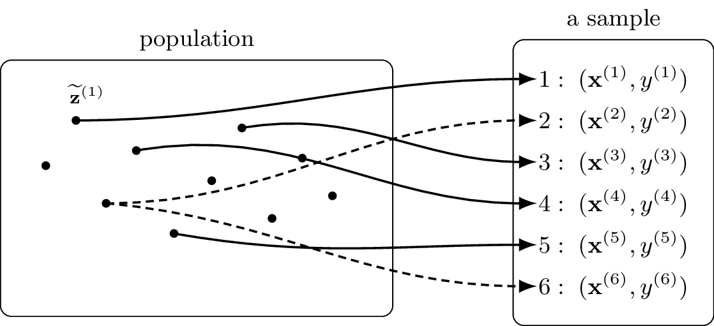

In the context of machine learning (ML), a sample is a finite sequence
(of length $m$) of data points, ${\bf z}^{(1)}, \ldots, {\bf z}^{(m)}$.
The number $m$ is called the sample size. Empirical risk minimization
(ERM)-based methods use a sample to train a model (or learn a
hypothesis) by minimizing the average loss (the empirical risk) over
that sample. Since a sample is defined as a sequence, the same data
point may appear more than once. By contrast, some authors in statistics
define a sample as a set of data points, in which case duplicates are
not allowed (Everitt and Skrondal 2010; Upton and Cook 2014). These two
views can be reconciled by regarding a sample as a sequence of
feature--label pairs, $\left( {\bf x}^{(1)},y^{(1)} \right), \ldots,
 \left( {\bf x}^{(m)},y^{(m)} \right)$. The $r$-th pair consists of the
features ${\bf x}^{(r)}$ and the label $y^{(r)}$ of an unique underlying
data point $\widetilde{{\bf z}}^{(r)}$. While the underlying data points
$\widetilde{{\bf z}}^{(1)},\ldots,\widetilde{{\bf z}}^{(m)}$ are unique,
some of them can have identical features and labels.

<figure id="fig:sample-sequence_dict">

<figcaption>A sample viewed as a finite sequence. Each element of this
sample consists of the feature vector and the label of a data point from
an underlying population. The same data point may occur more than once
in the sample. </figcaption>
</figure>

For the analysis of machine learning (ML) methods, it is common to
interpret (the generation of) a sample as the realization of a
stochastic process indexed by $\{1,\ldots,m\}$. A widely used assumption
is the independent and identically distributed assumption
(i.i.d. assumption), where sample elements
$\left( {\bf x}^{(r)},y^{(r)} \right)$, for $r=1,\ldots,m$, are
independent and identically distributed (i.i.d.) random variables (RVs)
with a common probability distribution.\
See also: dataset, sequence, independent and identically distributed
assumption (i.i.d. assumption).

Everitt, B. S., and A. Skrondal. 2010. *The Cambridge Dictionary of
Statistics*. 4th ed. Cambridge, U.K.: Cambridge Univ. Press.

Upton, Graham, and Ian Cook. 2014. *A Dictionary of Statistics*. 3rd ed.
Oxford Univ. Press.

---

📚 This explanation is part of the [Aalto Dictionary of Machine Learning](https://AaltoDictionaryofML.github.io) — 
an open-access multi-lingual glossary developed at Aalto University to support 
accessible and precise communication in ML.
