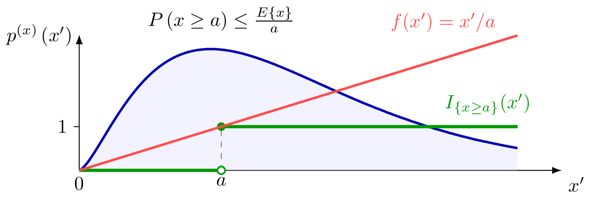

Consider a real-valued non-negative random variable (RV)  for which
the expectation  exists. Markov's inequality provides an
upper bound on the probability  that  exceeds a given
positive threshold . In particular,
 This inequality can be verified by
noting that  is the expectation  with
the function

As illustrated in Figure
[1](#fig:markovsinequality_dict){reference-type="ref"
reference="fig:markovsinequality_dict"}, for any positive ,
 This implies
{reference-type="eqref"
reference="eq:markovsinequality_dict"} via the monoticity of the
Lebesgue integral (Folland 1999, 50).

<figure id="fig">
  
  <figcaption>
    The expectation  and the probability 
of a non-negative random variable (RV) with probability distribution
 can be obtained via Lebesgue integral of 
and ,
respectively.
  </figcaption>
</figure>

\
See also: expectation, probability, concentration inequality.

Folland, Gerald B. 1999. *Real Analysis: Modern Techniques and Their
Applications*. 2nd ed. New York, NY, USA: Wiley.

---

📚 This explanation is part of the [Aalto Dictionary of Machine Learning](https://AaltoDictionaryofML.github.io) — 
an open-access multi-lingual glossary developed at Aalto University to support 
accessible and precise communication in ML.