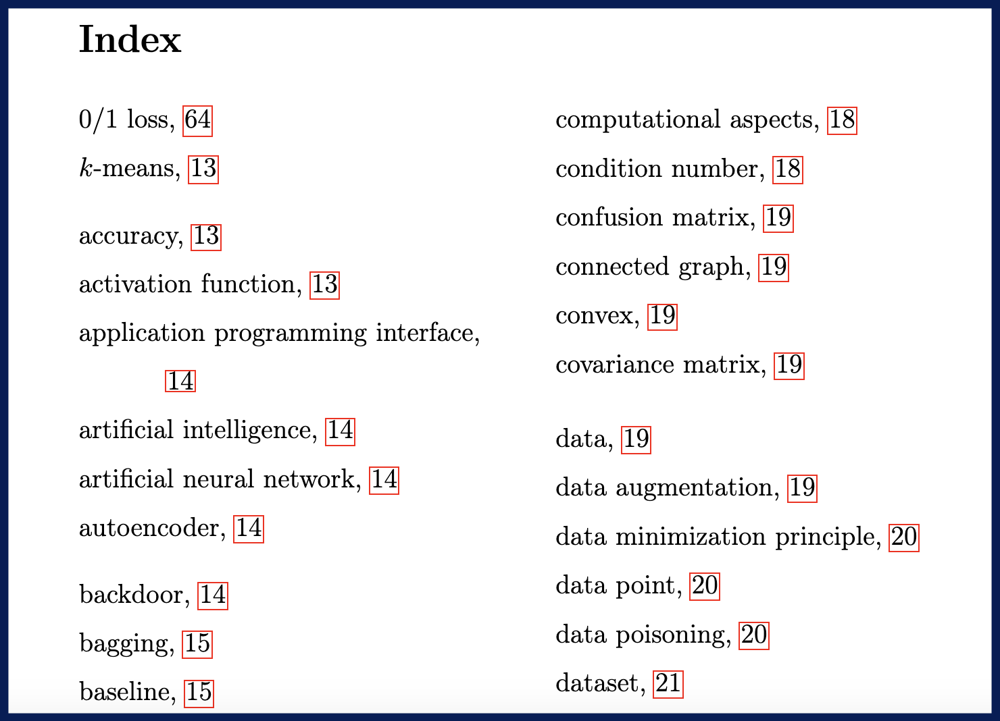

During my academic career, I’ve taught and mentored thousands of students in machine learning and related fields. 
I am passionate about breaking down complex concepts into clear, practical, and insightful materials that resonate 
with learners and professionals alike. I particularly enjoy crafting textbooks that offer accessible introductions to the 
core ideas of machine learning, bridging the gap between theory and application.
---

## **Published Books**

### **Machine Learning: The Basics**

**Language**: English  
**Publisher**: Springer, 2022  
**ISBN**: 978-981-16-8192-9 (Print), 978-981-16-8193-6 (eBook)  

The textbook *Machine Learning: The Basics* offers a comprehensive introduction to the fundamental 
concepts of machine learning, covering key algorithms and techniques in an accessible way. This book 
is ideal for newcomers and those seeking to strengthen their understanding of core principles.

[📖 Learn More or Purchase](https://link.springer.com/book/10.1007/978-981-16-8193-6)

---

### **Maschinelles Lernen: Die Grundlagen**

**Language**: German  
**Publisher**: Springer, 2024  
**ISBN**: 978-981-99-7971-4 (Print), 978-981-99-7972-1 (eBook)  

"Maschinelles Lernen: Die Grundlagen" is the German translation of "Machine Learning: The Basics." It brings the 
same clarity and foundational insights to German-speaking audiences, making it a valuable resource for students 
and professionals in machine learning.

[📖 Learn More or Purchase](https://link.springer.com/book/10.1007/978-981-99-7972-1)

---

## **Current Working Drafts**

### **Federated Learning - From Theory to Algorithms**

 
**Language**: English  
**Format**: PDF  

This textbook provides an in-depth introduction to federated learning, an emerging area in 
machine learning focused on decentralized data processing. Ideal for students and researchers 
looking to understand federated learning's theoretical foundations and practical applications.

[📄 Download the current draft (PDF)](https://github.com/alexjungaalto/FederatedLearning/blob/main/material/FL_LectureNotes.pdf)

---

### **The Aalto Dictionary for Machine Learning**

 

**Language**: English  
**Format**: PDF 

The Aalto Dictionary for Machine Learning is a curated glossary of essential terms and concepts in machine learning. 
It's a handy resource for students, professionals, and anyone looking to navigate the field with confidence.

[📄 Download a current draft (PDF)](https://aaltodictionaryofml.github.io/ADictML.pdf)

---

## Additional Resources

- 🎥 [Watch my YouTube Channel for Video Lectures](https://www.youtube.com/@alexjung111)  

Stay tuned for updates on upcoming books and projects!
