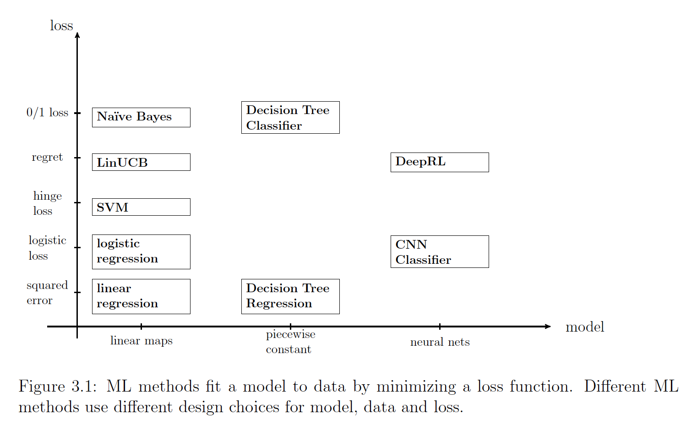

Machine learning is transforming nearly every field of science and technology, 
leading to its growing popularity across diverse disciplines. As a result, teaching 
introductory machine learning courses often means addressing the challenge of 
varying student backgrounds. 

To tackle this, I developed an innovative teaching framework that simplifies and 
structures the learning process for students from diverse fields.

## A Three-Component Perspective on Machine Learning

At the core of my teaching philosophy are three fundamental components of machine learning:

1. **Data Representation**  
2. **Model Design**  
3. **Loss Functions**

This framework decomposes any machine learning method into these three components, 
enabling students to grasp the core ideas and systematically explore the broad landscape 
of machine learning methods and applications.

The principles of this framework are extensively discussed in my textbook:  
**[Machine Learning: The Basics](https://link.springer.com/book/10.1007/978-981-16-8193-6)**  
*A. Jung, Springer, 2022.*

## Collaborate with Me

I am open to collaboration on teaching initiatives, curriculum design, and educational projects. 
If you're interested in leveraging my expertise in machine learning education, feel free to [contact me](mailto:alexjung235@gmail.com).

---

### Keywords: machine learning teaching, data representation, model design, loss functions, machine learning textbook, A. Jung

